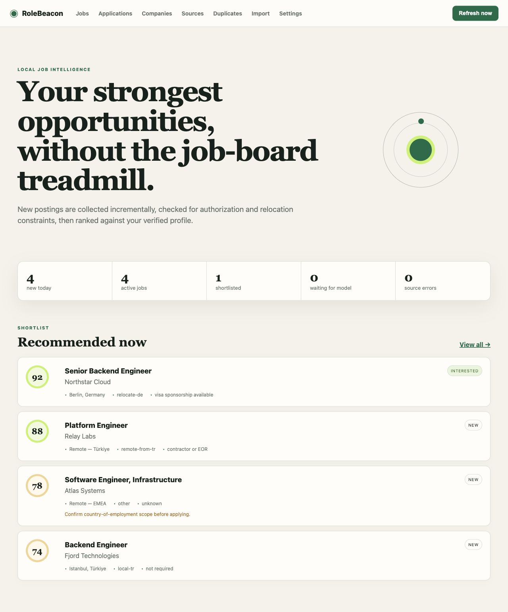
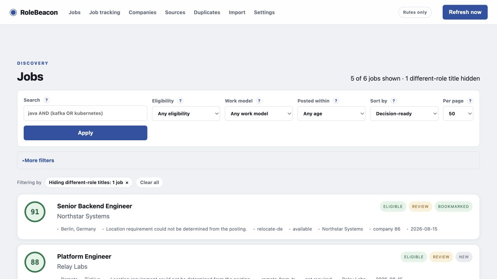
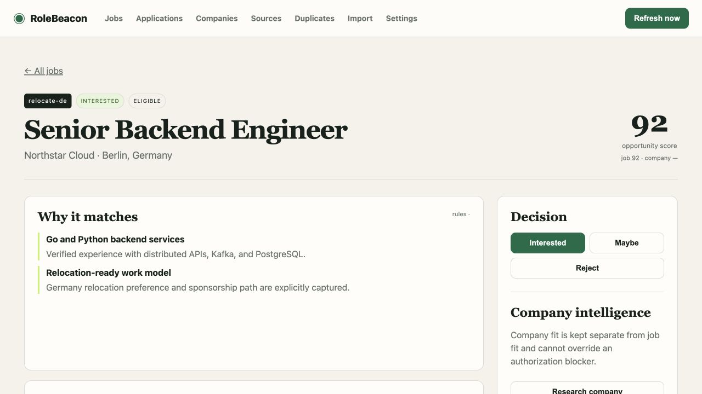
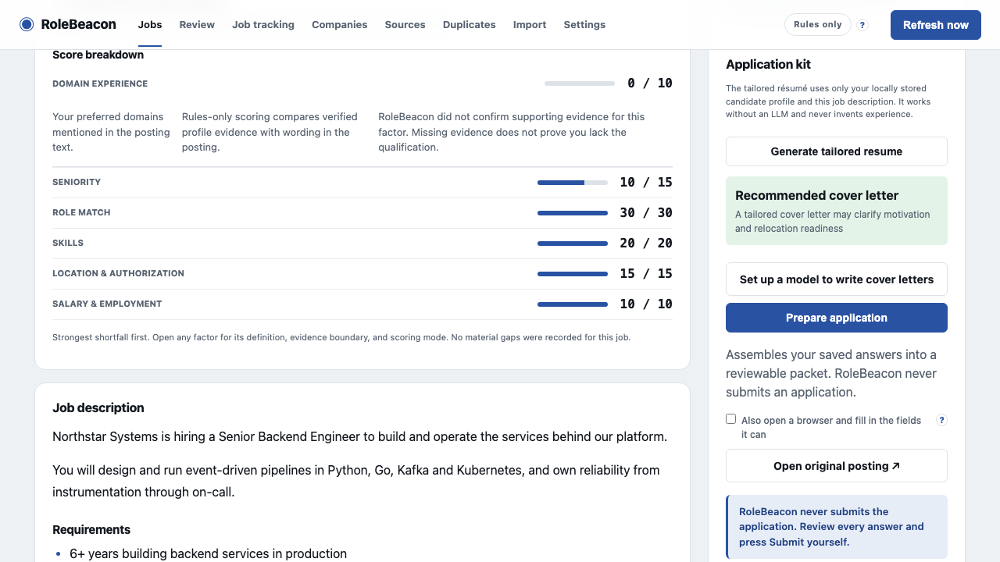
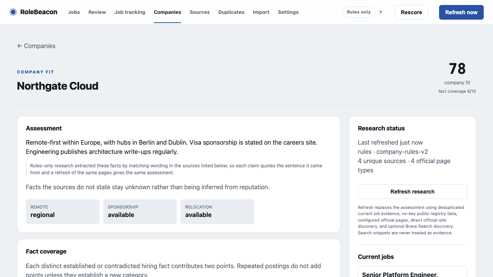
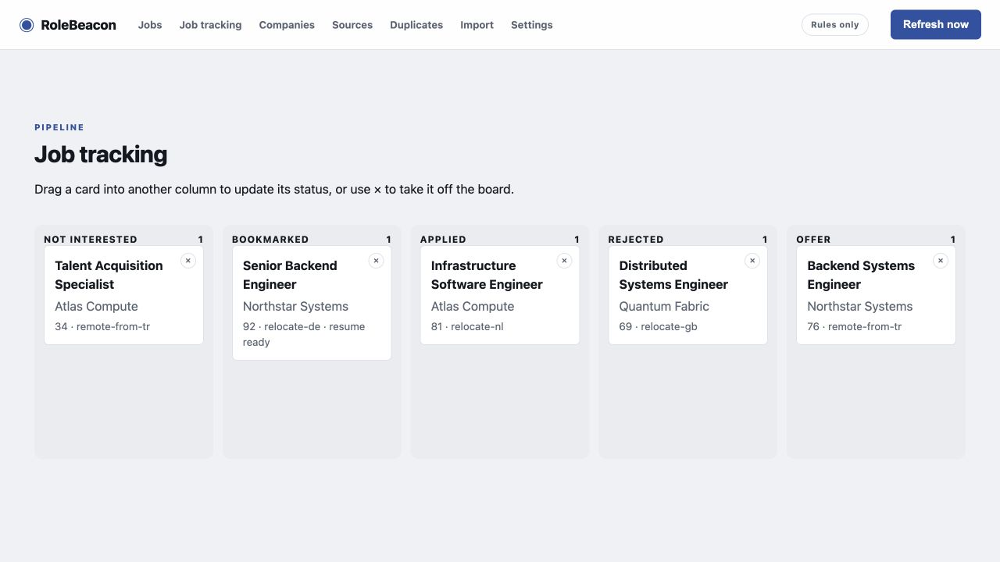
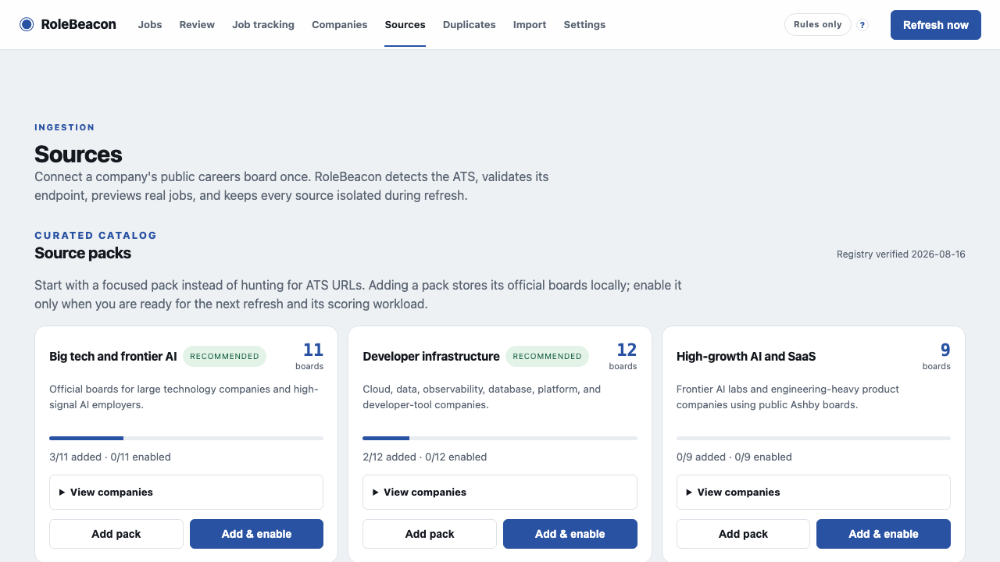
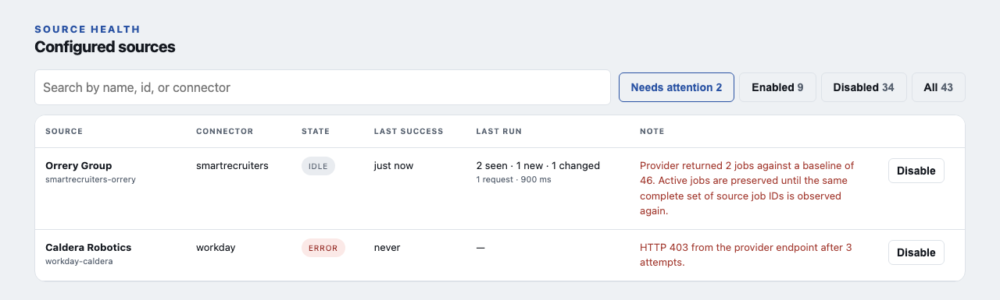
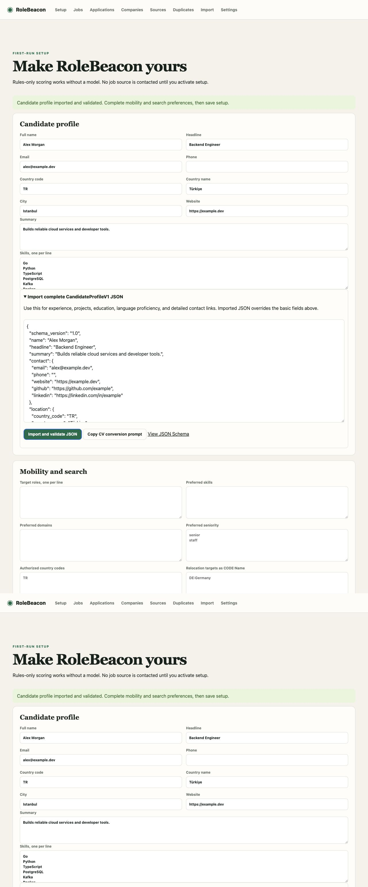

# RoleBeacon

**Find the roles worth your time.**

RoleBeacon is a local-first job discovery and application assistant. It collects public job
postings, checks location and work-authorization eligibility, scores fit against a user-owned
profile, researches companies with source-backed evidence, and prepares application artifacts
without ever submitting an application.

RoleBeacon works without an LLM. Deterministic rules provide collection, eligibility, ranking,
deduplication, full-text search, and application tracking out of the box. A local or remote
OpenAI-compatible model is an optional quality layer for evidence-rich scoring and writing.

## Highlights

- Incremental catch-up after downtime, with a 30-day first scan and 72-hour overlap thereafter.
- Public ATS and remote-job adapters with per-source health, retry, attribution, and deduplication.
- Guarded complete-snapshot reconciliation that preserves jobs when a provider returns an anomalous drop.
- Versioned candidate, mobility, and search-preference JSON schemas.
- Generated search strategies instead of hardcoded countries or companies.
- Eligibility gates before fit scoring: authorization, sponsorship, relocation, remote scope,
  clearance, blocklists, and explicit exclusions.
- Rules-only scoring by default; optional Ollama or custom OpenAI-compatible endpoints.
- Local SQLite and FTS5 storage in the operating-system application-data directory.
- Built-in HTML/PDF résumé renderer plus a safe external-command extension.
- Provenance-backed company research and a separate company-fit score.
- Selective, factual, on-demand cover letters.
- Human-approved browser preparation that cannot submit an application.

## Screenshots

All screenshots use synthetic candidate, company, source, and job data in an isolated local database.
No external source was contacted to produce them.

<p align="center">
  
  
</p>
<p align="center">
  
  
</p>
<p align="center">
  
  
</p>
<p align="center">
  
  
</p>
<p align="center"></p>

## Requirements

- Python 3.13
- [uv](https://docs.astral.sh/uv/)
- Chromium installed through Playwright when PDF résumés or browser preparation are needed

RoleBeacon supports macOS, Linux, and Windows. Docker is intentionally not required.

## Quick start

```bash
git clone https://github.com/srknzl/rolebeacon.git
cd rolebeacon
uv sync --extra dev
uv run playwright install chromium
uv run rolebeacon serve
```

Open `http://127.0.0.1:8787`. The first-run wizard offers a guided manual path or a strict prompt for
producing `SetupPayloadV1` JSON with an LLM of your choice. It then walks through the candidate profile,
eligibility-critical authorization and mobility facts, focused source-pack selection, optional
scoring/application settings, and a final activation review. No source request or
scheduled sync occurs until you review and activate setup.

Run a readiness check at any time:

```bash
uv run rolebeacon doctor
```

Every command prints a readable summary on a terminal and machine-readable JSON when its output is
piped or redirected, so a person gets a verdict and a script gets a stable document. `--json`, before
or after the subcommand, asks for the JSON explicitly.

```bash
uv run rolebeacon status
uv run rolebeacon status --json
```

### Setup without a browser

`rolebeacon setup` runs the same six steps in the terminal, using the same schemas, source catalog,
completeness review, and activation service as the web wizard. Nothing is written until the final
confirmation, so `q` at any prompt leaves the installation untouched, and `b` returns to the previous
step. Unlike the web checkbox, the terminal activation prompt defaults to *no*: collection starts only
when you type `y`.

```bash
uv run rolebeacon setup
```

Headless import uses the same schema and validation service. It does not activate collection unless
`--activate` is explicitly supplied, and `--no-interactive` refuses to open the wizard at all:

```bash
uv run rolebeacon setup --from-json /path/to/setup.json
uv run rolebeacon setup --from-json /path/to/setup.json --activate
```

### Headless job discovery

Run one refresh and export the complete ranked job corpus plus the dashboard-compatible recommendation
subset from the same local setup used by the web app:

```bash
uv run rolebeacon jobs
```

For a self-contained headless run, pass the same complete `SetupPayloadV1` used by headless setup. It
contains the candidate, mobility and authorization facts, preferences, enabled source IDs, scoring mode,
and activation choice. RoleBeacon validates and saves it through the shared setup service before running:

```bash
uv run rolebeacon jobs --from-json /path/to/setup-payload.json
```

Refreshing requires the document to contain `"activate": true`; `--from-json ... --no-sync` may import an
inactive setup because it contacts no external source.

The command creates a timestamped `rolebeacon-jobs-YYYY-MM-DD-HHMM/` directory, named in local time, in the
current directory.
It writes `recommended-jobs.json`, `recommended-jobs.md`, `all-jobs.json`, and `all-jobs.md`, then prints
their absolute paths. JSON contains the complete job, eligibility, scoring, and source-provenance fields;
Markdown is a scannable summary. The all-jobs export contains every active, unmerged job in decision-ready
order without a row limit. The recommended export matches the dashboard rule: job-fit score 65 or higher
and eligibility not `ineligible`, so an unresolved eligibility result stays visibly marked `unknown`.

Use existing local data without contacting sources or a model, choose another parent directory, or explicitly
start an already-installed Ollama before refreshing:

```bash
uv run rolebeacon jobs --no-sync
uv run rolebeacon jobs --from-json /path/to/setup-payload.json --no-sync
uv run rolebeacon jobs --output-dir /path/to/exports
uv run rolebeacon jobs --start-ollama
```

`--start-ollama` is valid only when the saved scoring mode is Ollama and its endpoint is HTTP loopback, such as
`http://127.0.0.1:11434/v1`; the command binds the process to that exact host and port. Manage a configured
LAN Ollama on its own host. The command never installs Ollama or pulls a model. Fatal refresh or model-start
failures still export the existing local database and return exit code 1;
partial source failures export usable results with a warning and return 0. Invalid flag combinations return 2
without writing an export.

## Scoring modes

### Rules only — recommended starting point

Rules-only mode is the default and requires no model, API key, or additional service. It provides
deterministic eligibility and transparent dimension scores. If an enabled model becomes unavailable,
refresh reports the failed preflight without contacting job sources; switch explicitly to Rules only
or restore the configured model before refreshing again.

### Guided Ollama

The setup page can detect an installed Ollama service. Explicit buttons can start an installed
service, pull a selected model, and test the endpoint. It also accepts a LAN Ollama address such
as `http://desktop.local:11434/v1`. The refresh panel reports each collection and scoring step,
whether the configured model is reachable. When an LLM is selected but unavailable, refresh stops before
collection or scoring; fix the endpoint/model or explicitly switch to Rules only, then refresh again.
RoleBeacon never installs Ollama or downloads a model silently.

`qwen3:8b` is the shipped default, chosen for size and not yet measured on this project's
rubric. For machines with enough memory, `qwen2.5:14b-instruct-q6_k` is the measured
recommendation (see `docs/local-model-guide.md`):
in a 25-job rubric evaluation it reached 0.87 rank correlation with deterministic scoring and 97%
evidence grounding, against `qwen3:14b`'s 0.32 correlation and more frequent generic-evidence and
empty-response rejections. Prefer instruct models over reasoning models for this task - the scoring
rubric is a shallow structured-output job, and reasoning spent tokens fighting the JSON schema
instead of reliably filling it.

Model quality is measured with a synthetic, privacy-safe scoring evaluation covering a strong backend
match, a frontend stack mismatch, transferable big-tech experience, ambiguous EMEA eligibility, and a
hard no-sponsorship blocker. Run the same rubric against any OpenAI-compatible model:

```bash
uv run rolebeacon evaluate-model \
  --base-url http://desktop.local:11434/v1 \
  --model qwen3:14b \
  --runs 2 \
  --output qwen3-14b-eval.json
```

The command fails when score bands, evidence/gap requirements, ranking checks, eligibility handling, or
schema consistency fail. It reports median and maximum latency so model changes can be compared fairly.

Run the same scenarios through the deterministic engine without any network or model dependency:

```bash
uv run rolebeacon evaluate-rules --runs 5 --output rules-eval.json
```

The rules report checks eligibility gates, score bands, dimension bounds and sums, ranking order, blocker
verdicts, and exact repeatability across runs.

The same actions are available from the CLI:

```bash
uv run rolebeacon model doctor
uv run rolebeacon model start
uv run rolebeacon model pull qwen3:8b
uv run rolebeacon model test --model qwen3:8b
```

### Custom OpenAI-compatible endpoint

Choose **Ollama** for local or LAN Ollama servers so RoleBeacon can use Ollama's native structured
output and measured, model-specific reasoning controls. Choose **Custom** for LM Studio, `llama.cpp`'s `llama-server`,
or another OpenAI-compatible service, then provide its base URL, model, and optional API key. The
browser never receives the stored API key.

RoleBeacon does not yet download or manage `llama.cpp` binaries itself. A future managed runtime
can implement the existing provider boundary without changing scoring or profile formats.

## Candidate profile

Setup supports guided form entry, a complete `CandidateProfileV1` JSON document, or a complete
`SetupPayloadV1` document containing the profile, mobility, preferences, selected sources, and model
settings. The first step can copy a schema-backed prompt for any LLM the candidate chooses; its JSON-only
result is validated locally and loaded into the same review flow. Source selection remains a later explicit
step, so the prompt leaves sources disabled and activation false. The wizard uses searchable country pickers
backed by the ISO 3166-1 catalog, then stores the corresponding country codes for matching. It can also
generate a review-only preference draft with an explicitly configured LLM. Neither path activates collection.
The public schema and CV-conversion prompt are available at:

```text
GET /api/schemas/candidate-profile
```

The conversion prompt instructs any chosen model to use only explicit CV facts. RoleBeacon
validates the result and rejects timeline contradictions before generating application artifacts.

The four stable setup schemas are:

- `CandidateProfileV1`
- `MobilityProfileV1`
- `SearchPreferencesV1`
- `SetupPayloadV1`

Country names are display values; eligibility uses ISO country codes. For example, the interface
displays `Türkiye` while storing `TR`.

## Search strategies and scoring

Setup generates strategies from the user's actual configuration:

- priority companies;
- countries where the candidate already has work authorization;
- relocation targets that may require sponsorship;
- remote work from the candidate's current country;
- an explicit fallback strategy.

The Jobs page hides titles from a clearly different role family by default, but this active default is
never silent: the page shows the visible-versus-total count, the number hidden, and a removable filter
chip that reveals those postings without changing the saved profile.

The deterministic score totals 100 points:

| Dimension | Points |
| --- | ---: |
| Role and domain match | 30 |
| Relevant skills | 20 |
| Domain experience | 10 |
| Seniority | 15 |
| Location and authorization | 15 |
| Salary and engagement model | 10 |

These values are the defaults. Setup can redistribute the 100 points using non-negative whole-number
weights, including zero for an advanced opt-out. A weight change produces a new stable scoring-behavior
version, so stale evaluations are requeued once. Location and authorization points always come from the
deterministic eligibility result, and eligibility remains a separate hard gate regardless of its weight.

Remote wording such as “EMEA” or “within your country of employment” is not treated as worldwide.
Unknown eligibility remains visible as a risk. Explicit no-sponsorship, clearance, blocklist, and
geographic restrictions cannot be overridden by company reputation or a high skills score.
Ordinary phrases such as “medical clearance” are not security-clearance requirements, and ambiguous
security-context mentions do not override work authorization on their own.

### What the optional LLM adds

RoleBeacon remains useful without an LLM. Rules-only mode applies the same eligibility gates and
produces deterministic dimension scores quickly, privately, and with exact repeatability. It is the
right default when hardware is limited or when collecting a large new source pack for the first time.

An LLM is an enhancement for interpreting unstructured job descriptions, not an eligibility oracle.
After deterministic authorization and geography checks, it adds:

- semantic matching when equivalent experience uses different wording, such as data-platform work
  versus storage infrastructure;
- requirement extraction from long prose, including exact missing technologies and qualifications;
- concrete “Why it matches” evidence tied to verified candidate-profile facts;
- clearer gap and risk explanations than keyword overlap alone;
- better recognition of transferable experience for broad software-engineering and big-tech roles.

The LLM cannot invent work authorization, sponsorship, salary, skills, experience, or candidate facts.
It cannot override a deterministic blocker. RoleBeacon calculates totals from bounded dimensions,
rejects generic or duplicate gaps and negative statements disguised as positive evidence, and asks the
model for one corrected response. If that response still fails validation, only that job keeps its
deterministic rules score; a genuine endpoint failure still stops LLM scoring and is reported.

The tradeoffs are model memory, latency, and an extra inference call when repair is required. For large
source packs, add the sources disabled, enable only the useful boards, and run the first collection in
rules-only mode before turning on LLM scoring. Use Ollama mode for local or LAN Ollama because it supports
native JSON Schema and a per-request context length. RoleBeacon leaves reasoning at each model's default
except for a measured `qwen3.6`-specific override; forcing it off for `qwen3:14b` produced materially worse
scores. The [local model guide](docs/local-model-guide.md) records the model-by-model evidence.

## Sources

Built-in source adapters include:

- Arbeitnow
- Jobicy
- Remotive
- Remote OK
- Himalayas
- We Work Remotely
- Greenhouse, Lever, Ashby, SmartRecruiters, Workday, and Personio public career endpoints
- Google Careers and Amazon Jobs first-party public-site connectors
- LinkedIn job search, through its credential-free guest endpoints or, if you switch it on, a
  browser you sign in to yourself
- optional Adzuna, Jooble, and SerpApi adapters

Only sources selected in setup are enabled. LinkedIn collection covers job search results and job
postings and nothing else — profiles, connections, messages, and the feed stay out of scope. The
Sources page carries both methods side by side, with the risk of the signed-in one and the steps
for using it, and switches either on as a whole. The default method never signs in. The signed-in
one opens a visible browser window, waits for you to log in, stores no credentials, reads only
posting descriptions through your session, and runs when you ask for a refresh, never on the
schedule:

```bash
uv run rolebeacon sync --interactive --force
```

See [docs/data-sources.md](docs/data-sources.md) before adding or enabling a source.

The Sources page also accepts a public company careers URL. RoleBeacon detects the connector, calls only
an allow-listed provider endpoint, previews sample jobs, and saves the source after confirmation. Google
Careers uses server-rendered public job pages; Amazon Jobs uses its public site JSON response. These
first-party contracts are health-checked and isolated because they are not documented public APIs.

The same page includes a versioned source catalog and curated packs such as Big tech and frontier AI,
Developer infrastructure, High-growth AI and SaaS, and Remote-friendly engineering. Packs are shortcuts
over official public board URLs, not bundled job data. **Add pack** stores boards without contacting them;
**Add & enable** explicitly schedules them for the next refresh. Installing the same pack again is
idempotent and preserves sources the user already enabled. The complete catalog can also be searched by
company or connector and each board can be added separately. Catalog entries include a verification date,
but upstream ATS ownership can still change, so failures remain isolated per source.

Complete provider snapshots are reconciled defensively. A sharp fall from the last accepted baseline is
preserved as an incomplete run and shown on the Sources page; RoleBeacon closes missing jobs only after the
same complete set of source job IDs is observed again. A response whose declared provider total exceeds the
raw returned records is never accepted as complete. Baselines and confirmation fingerprints use unique
source job IDs. See [docs/data-sources.md](docs/data-sources.md) for the
default thresholds and per-source overrides.

Job descriptions are normalized without an LLM. The ingestion layer repairs common encoding damage,
preserves paragraphs and source lists, removes non-content script/style markup, and the detail page
renders recognized headings, bullet groups, and bounded paragraphs. This keeps the original facts
available to scoring while making long postings readable and avoiding model-authored rewrites.

## Company research

Company research is useful without a paid search API. RoleBeacon first uses its bundled company/source
registry, then uses Wikidata only to discover a matching official domain, and finally fetches conventional
official pages such as careers and engineering. Collected job postings remain supporting evidence. A
registry outage never blocks research, and missing facts remain unknown.

An optional Brave Search API key can improve official-page discovery for companies absent from the
registry. Search results are discovery hints only: RoleBeacon does not score snippets or third-party
profiles. A claim enters an assessment only after the corresponding official page is fetched. The key is
stored in the local permission-restricted secrets file and never returned to the browser. Self-hosted
SearXNG is a possible future provider; scraping consumer search-result pages is intentionally unsupported.

The UI reports evidence coverage rather than presenting a model confidence percentage. Duplicate job
postings are collapsed, and strong coverage requires more than one distinct official source type. Employer
assessment focuses on hiring-relevant signals—remote policy, sponsorship, relocation, engineering
environment, compensation, and sourced risks—not generic catalog fields such as headquarters or size.

## Résumés and cover letters

The built-in renderer creates `resume.html`, `resume.json`, and `resume.pdf` from verified profile
facts. Skills may be reordered by relevance, but facts are never rewritten or invented.

An external renderer can be configured as an argument array with these placeholders:

- `{profile}` — verified candidate-profile JSON
- `{jd}` — job-description text file
- `{output}` — required PDF output path

External commands run without a shell. Cover letters are generated only on demand, use verified
candidate and job evidence, and always require review.

## Application safety

RoleBeacon may open supported Greenhouse, Lever, or Ashby forms, fill ordinary contact fields,
and upload a generated résumé. It does not answer salary, legal, demographic, authorization, or
custom questions automatically. It never clicks Submit.

## Local data and privacy

RoleBeacon uses `platformdirs`:

- macOS: `~/Library/Application Support/RoleBeacon`
- Linux: `${XDG_DATA_HOME:-~/.local/share}/RoleBeacon`
- Windows: the current user's local application-data directory

Profiles, SQLite databases, generated applications, browser sessions, OAuth tokens, and secrets
are excluded from Git. API keys are stored in a permission-restricted local secrets file. The web
application binds to `127.0.0.1` by default and rejects cross-origin state-changing requests.

Override storage only when necessary:

```bash
ROLEBEACON_DATA_DIR=/private/path uv run rolebeacon serve
```

## Legacy migration

Import a previous Job Radar installation with a copy-only, idempotent migration:

```bash
uv run rolebeacon migrate --from /path/to/job-radar
```

The importer copies the database and application artifacts when safe, records checksums, and
maps non-secret `JOB_RADAR_*` settings for review. It never moves source data and never imports
browser profiles or LLM API keys. Reauthorize browser sessions manually.

## HTTP API

Core endpoints are listed below; the running app exposes the complete interactive contract at `/docs`.

- `GET /api/setup/status`
- `GET /api/schemas/candidate-profile`
- `POST /api/setup/profile/validate`
- `POST /api/setup/validate`
- `POST /api/setup/plan`
- `POST /api/setup/model/discover`
- `POST /api/setup/model/test`
- `POST /api/setup/complete`
- `POST /api/sync`
- `GET /api/sync/status`
- `GET /api/model/status`
- `GET /api/source-packs`
- `POST /api/source-packs/{id}/install`
- `POST /api/sources/discover`
- `POST /api/sources`
- `POST /api/sources/{id}/enabled`
- `GET /api/jobs`
- `POST /api/jobs/{id}/feedback`
- `POST /api/jobs/{id}/resume`
- `POST /api/jobs/{id}/cover-letter`
- `POST /api/jobs/{id}/prepare-application`
- `POST /api/jobs/{id}/research-company`
- `GET /api/companies`
- `GET /api/companies/{id}`
- `POST /api/companies/{id}/research`
- `GET /api/applications`
- `POST /api/imports/preview`
- `POST /api/imports`

## Development

```bash
uv sync --extra dev
uv run ruff check .
uv run mypy src/rolebeacon
uv run pytest
uv run python -m build
```

`AGENTS.md` and `CLAUDE.md` are intentionally byte-for-byte identical and must be updated together.

## Remaining roadmap

The web setup flow, the interactive terminal wizard, schema-driven headless import, and one-command
ranked job export are complete. Planned and proposed work is tracked in
[GitHub issues](https://github.com/srknzl/rolebeacon/issues). Larger remaining themes are:

- provide a managed, checksum-verified `llama.cpp` runtime as an Ollama-free optional path;
- make ATS and company registries user-editable without weakening runtime validation;
- add dedicated first-party connectors for unsupported company-specific sites such as Microsoft,
  Meta, Apple, and Netflix;
- extend human-reviewed browser preparation beyond Greenhouse, Lever, and Ashby while preserving the
  prohibition on final submission; and
- calibrate ranking after at least 50 explicit user decisions, measured with precision at 10 and the
  eligibility false-positive rate.

## Contributing and security

See [CONTRIBUTING.md](CONTRIBUTING.md) before opening a pull request. Report vulnerabilities using
[SECURITY.md](SECURITY.md), not a public issue.

RoleBeacon is licensed under the [Apache License 2.0](LICENSE).
